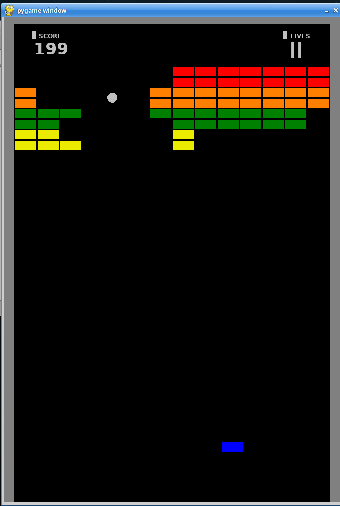

A [Breakout](https://en.wikipedia.org/wiki/Breakout_(video_game)) clone made with python and pygame 

From wikipedia:
>Breakout begins with eight rows of bricks, with each two rows a different color. The color order from the bottom up is yellow, green, orange and red. Using a single ball, the player must knock down as many bricks as possible by using the walls and/or the paddle below to ricochet the ball against the bricks and eliminate them.

# Requirements

Requires python 3.7 or higher, and pygame 2.x to run the python script.

# FEATURES
### Scoring
- Yellow = 1 point
- Green = 3 points
- Orange = 5 points
- Red = 7 points

### Mechanics
- Three Lives
- Paddle shrinks by 1/2 after hitting top wall
- Two "levels"
- Ball speed increases: after four hits, after twelve hits, and after making contact with orange and red rows

# How to Play

Press _SPACE_ to launch ball

Use the _A_ keyboard key to move paddle left

Use the _D_ keyboard key to move paddle right

Try to beat both "levels"!

