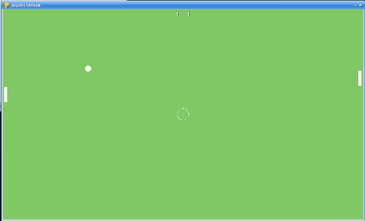

A simple [Pong](https://en.wikipedia.org/wiki/Pong) like game

## Features
- AI Opponent
- Score Keeping – Must score 11 points and win by 2
- Start pop-up - `Click Box To Start Game`
- Random start for direction of ball
- Win / Lose pop-up- `Game Over Click Screen To Play Again`

## How to Play
1. On the Intro Screen click `Click Box To Start Game`
2. Use the keyboard to control the player paddle (left side of screen)

| Control            | Button        |
|--------------------|---------------|
| Move Paddle Up     | <kbd>W</kbd>  |
| Move Paddle Down   | <kbd>S</kbd>  |

3. Win or lose, you have option to play again. `Game Over Click Screen To Play Again`
