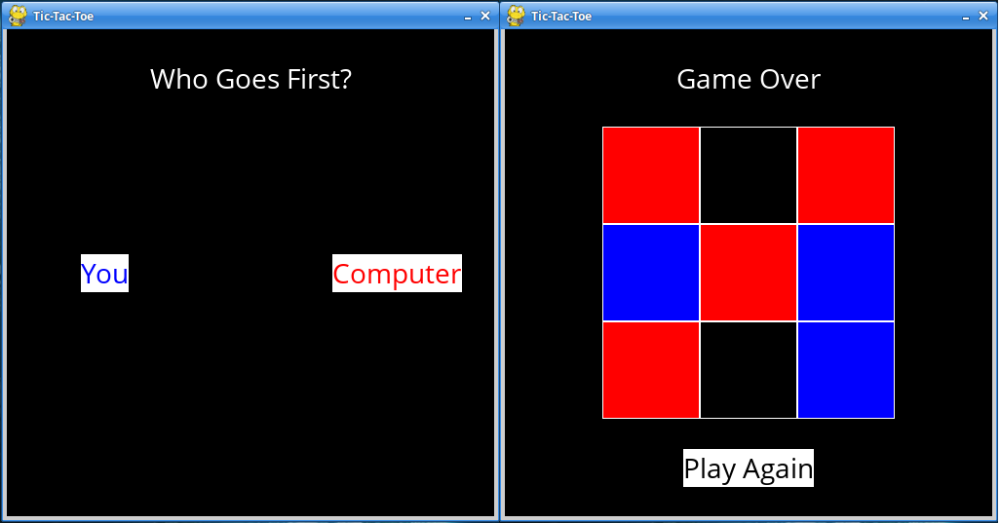

# Pygame Tic-Tac-Toe With Minimax AI

[Tic-Tac-Toe](https://en.wikipedia.org/wiki/Tic-tac-toe) with squares!

## Features
- An "unbeatable" AI that uses a [minimax](https://en.wikipedia.org/wiki/Minimax) algorithm to choose its optimal move
- A _Who Goes First?_  selection screen
- Play Again Options

## How to Play
1. Choose first player, the AI (__red__) or you (__blue__)
2. Click inside boxes to make your move, than the AI responds
3. Try to beat the AI. Good luck!
